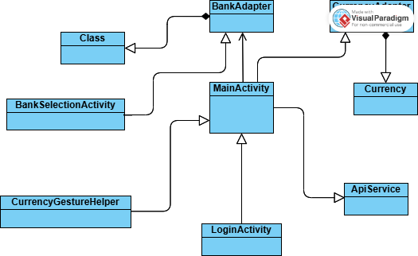

# Диаграмма классов  

 

# Глоссарий

| Класс | Описание |
|:---|:---|
| **MainActivity** | Главное окно приложения, где отображается список валют и текущие курсы. |
| **LoginActivity** | Экран авторизации, на котором пользователи вводят данные для входа. |
| **BankSelectionActivity** | Экран выбора банка, где отображаются доступные банки с актуальными курсами валют. |
| **BankAdapter** | Адаптер для отображения списка банков на экране выбора банка. |
| **CurrencyAdapter** | Адаптер для отображения списка валют на главном экране. |
| **Bank** | Модель данных для представления информации о банке, включая название и текущий курс валют. |
| **Currency** | Модель данных для представления валюты, включая её код, название и флаг страны. |
| **ApiService** | Утилита для работы с API банков, обеспечивающая загрузку курсов валют. |
| **GestureHelper** | Утилита для обработки жестов, таких как свайп для удаления валют и перетаскивание блоков валют. |
