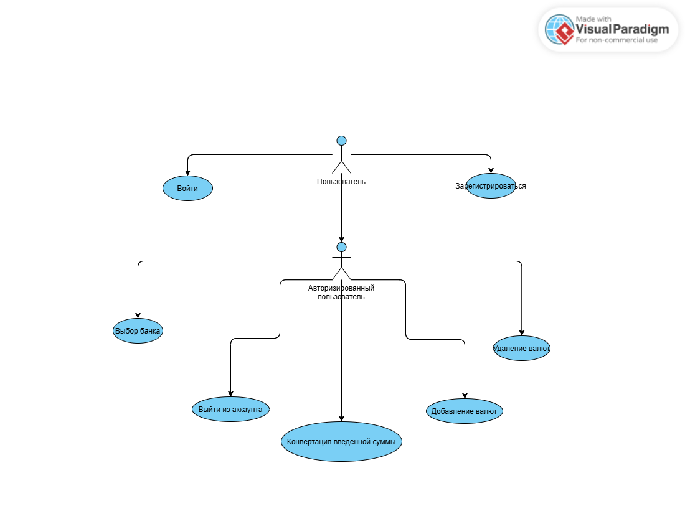

# Сценарий использования "Currency Converter"

 

# Глоссарий

| Термин                     | Определение |
|----------------------------|-------------|
| Пользователь               | Человек, использующий приложение |
| Авторизованный пользователь | Пользователь, прошедший авторизацию в приложении |

# Поток событий

# Содержание
1 [Актёры](#actors)  
2 [Варианты использования](#use_case)  
2.1 [Авторизация пользователя](#user_authentication)  
2.2 [Выбор банка](#select_bank)    
2.3 [Выбор валют](#select_currency)  
2.4 [Конвертация валюты](#currency_conversion)  
2.5 [Удаление валюты](#delete_currency)  
2.6 [Изменение порядка валют](#reorder_currency)  

<a name="actors"/>

# 1 Актёры

| Актёр                     | Описание |
|---------------------------|-------------|
| Пользователь              | Человек, использующий приложение |
| Авторизованный пользователь | Пользователь, прошедший авторизацию в приложении |

<a name="use_case"/>

# 2 Варианты использования

<a name="user_authentication"/>

## 2.1 Авторизация пользователя

**Описание.** Вариант использования "Авторизация пользователя" позволяет пользователю войти в приложение.  
**Предусловия.** Пользователь выбрал пункт "Вход" на экране авторизации.  
**Основной поток.**
1. Приложение отображает экран авторизации;
2. Пользователь вводит свои данные;
3. Приложение проверяет данные и предоставляет доступ к приложению, если проверка прошла успешно;
4. Вариант использования завершается.

<a name="select_bank"/>

## 2.2 Выбор банка

**Описание.** Вариант использования "Выбор банка" позволяет пользователю выбрать банк, чьи курсы валют будут использоваться для конвертации.  
**Предусловия.** Пользователь авторизован и находится на главном экране.  
**Основной поток.**
1. Приложение отображает экран с доступными банками и текущими курсами;
2. Пользователь выбирает банк;
3. Приложение сохраняет выбор пользователя и применяет курс выбранного банка для конвертации валют;
4. Вариант использования завершается.

<a name="select_currency"/>

## 2.3 Выбор валют

**Описание.** Вариант использования "Выбор валют" позволяет пользователю выбрать валюты для отображения на главном экране.  
**Основной поток.**
1. Приложение отображает экран с доступными валютами;
2. Пользователь выбирает необходимые валюты;
3. Приложение добавляет выбранные валюты на главный экран;
4. Вариант использования завершается.

<a name="currency_conversion"/>

## 2.4 Конвертация валюты

**Описание.** Вариант использования "Конвертация валюты" позволяет пользователю конвертировать сумму из одной валюты в другую с использованием актуальных курсов банка.  
**Предусловия.** Пользователь выбрал валюты на главном экране.  
**Основной поток.**
1. Пользователь вводит сумму в одной из валютных полей;
2. Приложение автоматически пересчитывает сумму для всех других валют;
3. Приложение отображает результат конвертации;
4. Вариант использования завершается.

<a name="delete_currency"/>

## 2.5 Удаление валюты

**Описание.** Вариант использования "Удаление валюты" позволяет пользователю удалять валюты с главного экрана.  
**Основной поток.**
1. Пользователь делает свайп влево на блоке валюты, которую хочет удалить;
2. Приложение удаляет валюту с главного экрана;
3. Вариант использования завершается.

<a name="reorder_currency"/>

## 2.6 Изменение порядка валют

**Описание.** Вариант использования "Изменение порядка валют" позволяет пользователю менять порядок отображаемых валют.  
**Предусловия.** Пользователь авторизован и добавил валюты на главный экран.  
**Основной поток.**
1. Пользователь перетаскивает блок валюты на главном экране;
2. Приложение сохраняет новый порядок валют;
3. Вариант использования завершается.
